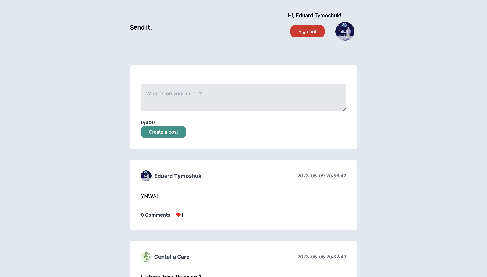

# PostIt - React Next.js App

## Overview
PostIt is a simple web application built with React and Next.js that allows users to create and share text-based notes. It provides an easy way to jot down thoughts, ideas, and reminders in a digital format. This project is designed to be minimalistic, user-friendly, and responsive.

## Features
- **Create Notes:** Easily create new notes with a title and content.
- **Edit and Delete:** Edit or delete existing notes.
- **Add and remove likes to post:** Like or unlike posts.
- **Responsive Design:** Works seamlessly on both desktop and mobile devices.

## Installation
1. Clone this repository: `git clone https://github.com/EdwardTymoshuk/postit-react-next-app.git`
2. Navigate to the project directory: `cd postit-react-next-app`
3. Install dependencies: `npm install`

## Usage
- Start the development server: `npm run dev`
- Access the application in your browser at `http://localhost:3000`

## Technologies Used
- React: A JavaScript library for building user interfaces.
- Next.js: A framework for building React applications.
- Styled-components: A CSS-in-JS library for styling components.
- TypeScript: A strongly typed programming language that builds on JavaScript.

## Contributing
Contributions are welcome! If you'd like to contribute to this project, please follow the standard GitHub fork and pull request process.

## License
This project is licensed under the MIT License. See the [LICENSE](LICENSE) file for details.

## Contact
For any inquiries or feedback, please contact the project owner:
- Eduard Tymoshuk
- Email: [eduard.tymoshuk@gmail.com](mailto:eduard.tymoshuk@gmail.com)
- GitHub: [https://github.com/EdwardTymoshuk](https://github.com/EdwardTymoshuk)
